# modul 3 Multipel lineær regression

Udvidelse af den simple lineære model

## Repetition fra sidst (Igen)

Hvordan definerer vi spredning (sd)? Svar: Et mål for fordelingen af tallene i et datasæt. En stor spredning målt som en høj standard deviation ses ved tal i datasæt med stor variation omkring middelværdien (u) omvendt for datasæt med lille variation.

Hvordan fortolkes et referenceinterval? Svar: Referenceintervallet indeholder X% af fordelingen af datapunkter i baggrundspopulationen. Eks. inkluderer u +/- 1.96\*sd 95% af fordelingen af datapunkter i baggrundspopulationen.

Hvordan definerer vi standard error of the mean (SEM)? Svar: SEM er spredningen på tilfældigt udtagne stikprøvegennemsnit udregnet ud fra stikprøvestørrelse (n) og spredningen i baggrundspopulationens værdier.

Hvordan fortolkes et konfidens interval? Svar: Konfidensintervallet indeholder middelværdien i baggrundspopulationen med X sandsynlighed.  Eks. inkluderer u +/- 1.96\* SEM den egentlige u i baggrundspopulationen med 95% sandsynlighed.

## Kommandoer i R

Forskellige regressionsanalyser i R har forskellige kommandoer. De vigtigste er:

Lineær regression (Modul 2)  lm(y \~ x)

Multipel lineær regression (Modul 3)  lm(y \~ x + z), I multiple lineær regression kan man inkludere mange flere end blot to forklarende variable. Idag!

Logistisk regression (Modul 4)  glm(lbwt \~ factor(smoke) + age, family=binomial) Vi vender tilbage til denne!

## Std. Error, t- og p-værdi i lineær regression

Estimatet har altså en usikkerhed svarende til Std. Error. Dermed kan man lave en one sample t-test for hvor sandsynligt der er at finde denne stikprøve hvis hældningskoefficienten i baggrundsbefolkningen i virkeligheden er 0 

T-test = (Estimate -0)/Std. Error

Ovenstående giver t-værdien, og p-værdien er regnet ud fra denne! Udregning: (0.139/0.00408) =

Dvs meget usandsynligt!

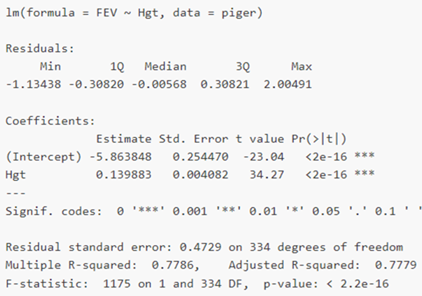

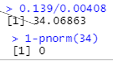

## Eksamensopgave

Her ser vi på multipel lineær regression, da vi har flere variable. OBS factor() betyder at variablen er kategorisk dvs. enten 0 eller 1  ikke vigtig for vores udregninger i denne opgave!

Hvordan udregner vi de manglende tal, så vi kan konkludere?

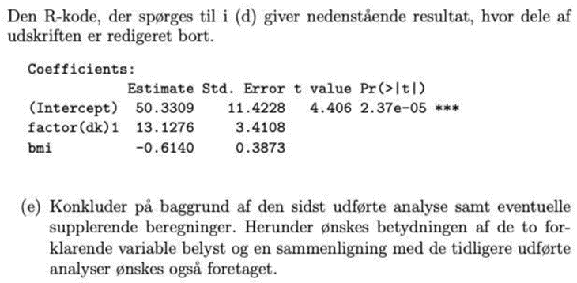

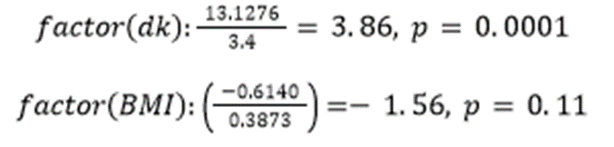

## Multipel lineær regression

Brugbart når man ønsker at undersøge flere variables (forklarende) betydning for en responsvariabel. Giver ofte en større akkuratesse ved prædiktion. Kan se på den individuelle effekt af variable dvs. korrigeret for andre variable. Nedenfor ses multipel lineær regression med responsvariabel FEV1 og kontinuert forklarende variable Age og Height.

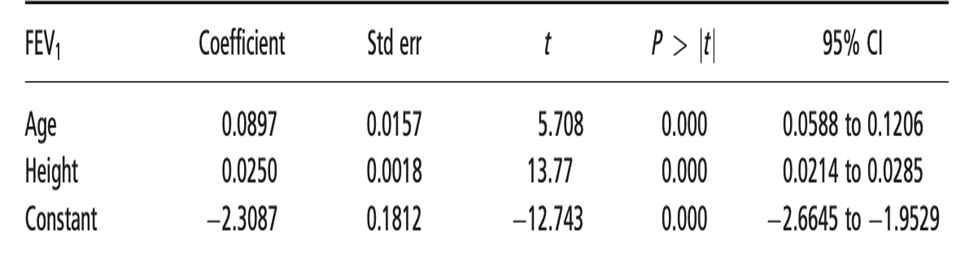

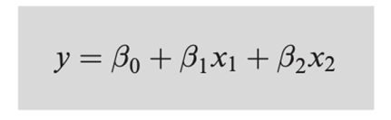

Tolkning: y= responsvariabel (FEV1) B0 = interceptet, dvs. FEV1 når alder og højde er 0. B1 = koefficienten for variabel 1 B2 = koefficienten for variabel 2

Std.error = angiver SE dvs. den usikkerhed estimaterne er givet ved, kan bruges til konfidensinterval og t-værdi.

T = Teststørrelse for 0-hypotesen at koefficienten

P= p-værdi for teststørrelsen

## Multipel lineær regression opgave

En vigtig pointe er at multipel lineær regression viser variablernes effekt med de øvrige variable fastholdt. Dvs vi kan se på de individuelle effekter af hver variabel  muliggør afsløring af confounding! Man kan eks tolke Age´s effekt som: FEV1 stiger gennemsnitligt med 0,0946 når højde øges med 1 med køn og alder fastholdt.

Opgave 1: Fortolk nedenstående estimater (coefficients)? Er de signifikante? Opgave 2: Hvilken type variabel er variablen ”Male” og hvad siger den om piger og drenges lungefunktion? Opgave 3: Giv et 95% - konfidensinterval for højdes regressionkoefficient?

1=JA! (P-værdi er \< 0.05)

2=Kategorisk, mænd har estimeret 0.12 bedre lungefunktion end en kvinde med samme alder og højde dvs fastholdt for disse

3= estimat +/- 1.96\* std error

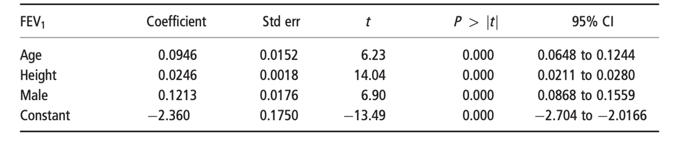

## Eksamensopgave fortsat

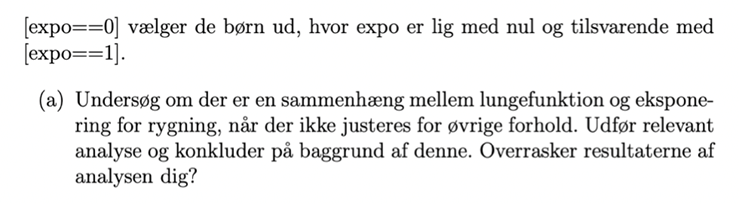](images/paste-29.png)

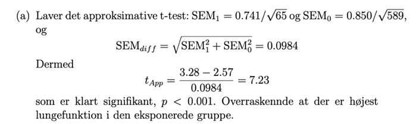

Dvs. en 2- sample T-test!

## Eksamensopgave fortsat

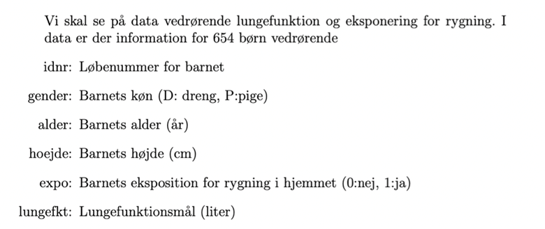

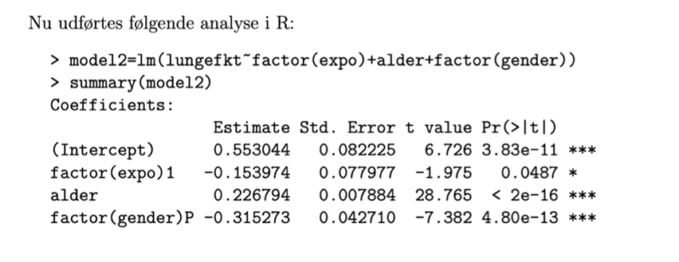

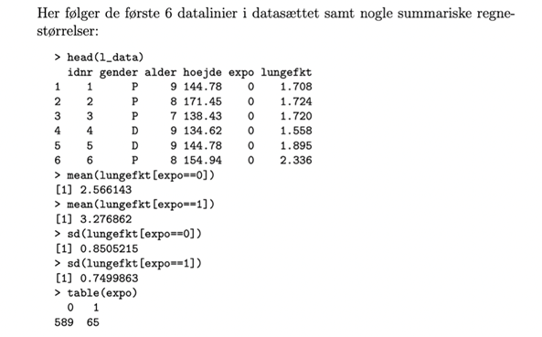

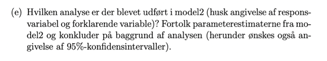

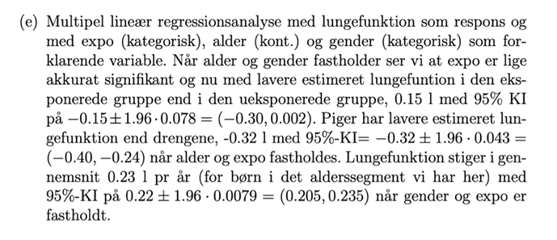

## Prædiktion ud fra modeller

Formålet med statistiske modeller er at kunne forudsige (prædiktere, predict). Husk at vi anser vores datasæt som en stikprøve ud af hele populationen. Hvis stikprøven er repræsentativ for populationen (den deskriptive statistik), vil vi kunne forudsige noget om resten af populationen på baggrund af modellen, hvis modellen er god.

Vi tager vores model igen: Ud fra denne har vi ligningen y=-5.86 + 0.139x

Vi kan bruge denne til at prædiktere FEV ved en given højde eksempelvis højde 2 meter dvs 200cm 

-5.86 + 0.139\*200 = 22.1 prædikteret

OBS resultat giver ikke mening fordi modellen er i tommer, men udregningen er korrekt

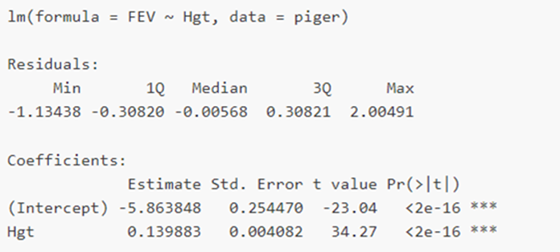

## Eksamensopgave pædiktion

Du får nedenstående model. Modellen er multipel lineær regression, derfor introduceres 2 nye regler til prædiktion: 1. Hvis variablen er factor() indikerer dette eks. om patienten har fået halothane eller ej, dvs. Den er kategorisk og indgår i prædiktion som enten 1 eller 0 gange estimatet. 2. I multipel lineær regression adderes hvert led og dens værdi på i regnestykket, dvs. intercept + leg*0.79 + factor(drug)* 7.41 = prædikteret værdi

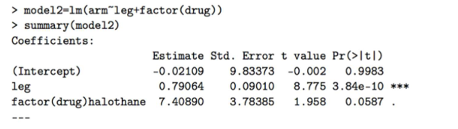

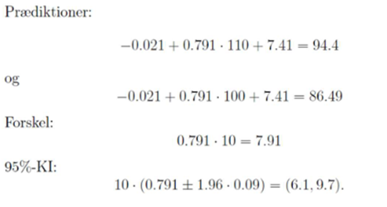

## Kategoriske variable

Vi har primært kigget på kontinuerte variable indtil videre, men i mange situationer har vi kun kategoriske variable til rådighed! Eksempelvis når vi kigger på sandsynligheder for sygdom i 2 grupper:

Antag at du har to grupper som nedenfor, hvordan afgør vi om der er større sandsynlighed for KOL som ryger vs. Ikke-ryger?

Heldigvis er det meget nemt! Vi udregner sandsynligheden i hver gruppe:

Rygere = syge/totale = 35/135 = 0.259 = 25,9% Ikke-rygere = syge/ totale = 38/188 = 0.202 = 20,2%

Estimaterne er jo stikprøver, så hvordan udregner vi SE for sandsynlighederne?

S.E. 

Dvs. vi har nu sandsynligheder med en usikkerhed SE  Vi kan lave alle de T-test og konfidensinterval vi kender! Eks 

Eks. Sammenligne konfidensintervaller: SE rygere: √((0.259∗(1−0.259))/)135= 0.0377 SE ikke-rygere: √((0.202∗(1−0.202))/) 188= 0.029

Eks kan vi lave konfidensinterval og se om de overlapper:

Rygere = 0.259 +/- 1.96*0.0377 = (0.185,0.332) Ikke-rygere = 0.202 +/- 1.96*0.029 = (0.145, 0.256)

Overlapper  Vi kan ikke forkaste nul-hypotesen! Vi kan også udregne SE for differensen og lave 2-sample t-test!

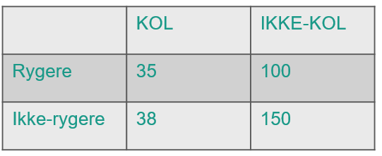

## Relativ risiko (RR)

Relativ risiko er en anden måde at udtrykke 2 gruppers sandsynligheder i forhold til hinanden dvs om de er signifikant forskellige. Beregningen er lidt mere kompliceret, men fortolkningen er heldigvis nem!

Vi tager KOL værdierne igen:

Rygere = syge/totale = 35/135 = 0.259 = 25,9% Ikke-rygere = syge/ totale = 38/188 = 0.202 = 20,2%

RR= 0.259/0.202= 1.2821

Log(SE) udregnes ved formlen

DVS  log(SE)√((1/35)−(1/135)+(1/38)−(1/188))= 0.2

Vi udregner nu log(1.2821) så vi kan exp hele udtrykket!

log(1.28)=0.248

Nu udregner vi konfidensintervallet og konkluderer:

Exp(0.248 +/- 1.96\*0.2) = (0.866,1.896) Bemærk  da 1 er indeholdt kan vi ikke på et 95% signifikansniveau afvise at den sande relative risiko er 1 og dermed ens mellem rygere og ikke-rygere!  Ingen signifikant forskel!

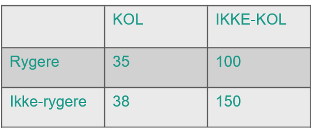](images/paste-44.png)

## Eksamensopgave

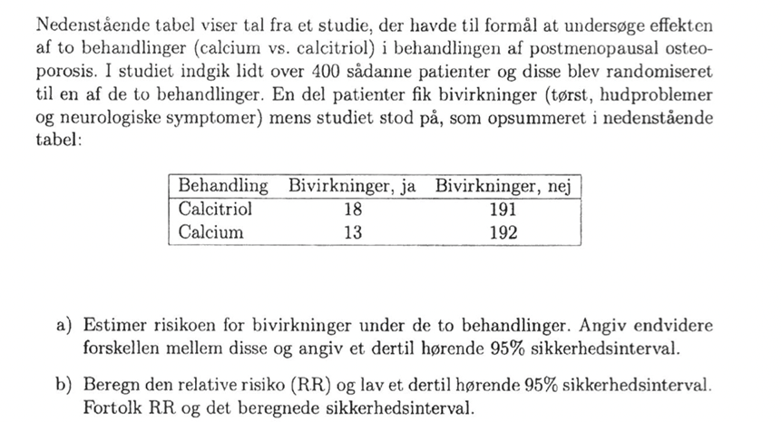

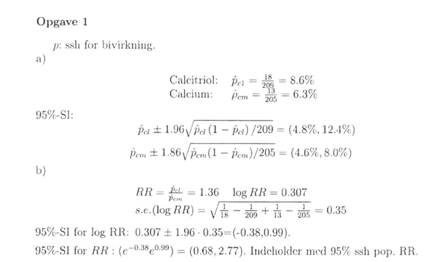