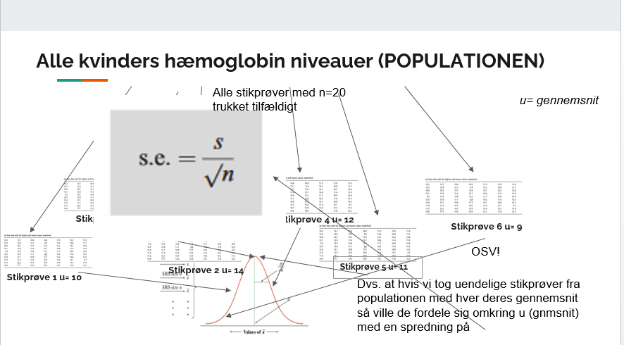
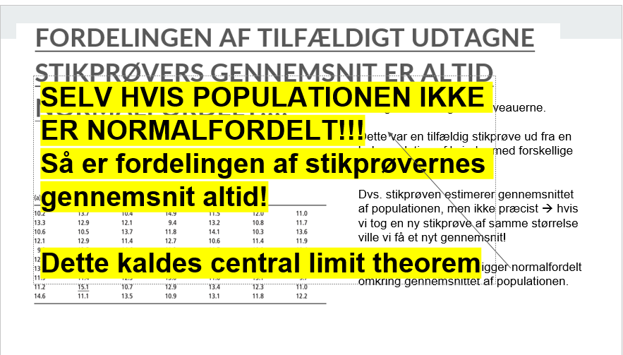
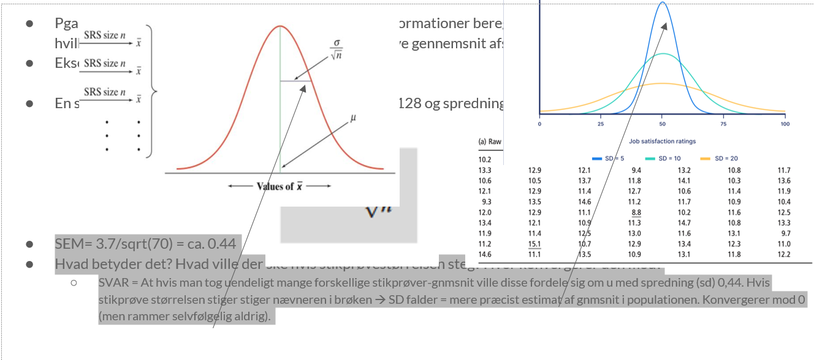
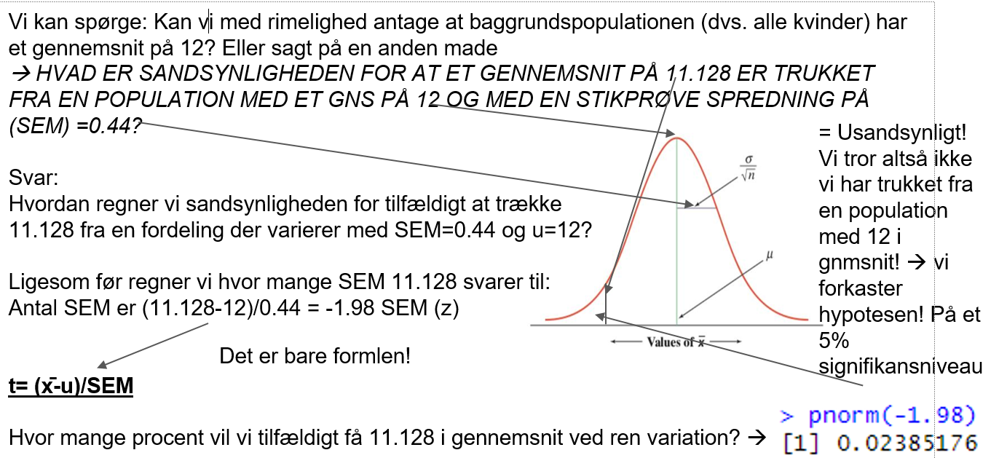
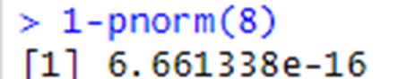
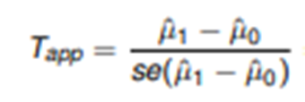

# statistik intro

for puff

# Formålet med statistik

”Statistics is the science of collecting, summarizing, presenting and interpreting data, and of using them to estimate the magnitude of associations and test hypotheses. It has a central role in medical investigations” Indledende afsnit i lærebogen ”Medical statistics””

Dvs  Statistik bruges til at forstå, estimere og udlede information baseret på data

Deskriptiv statistik for at forstå data Histogrammer Gennemsnit, spredning (sd), percentiler, range Estimater og usikkerhed på estimaterne

Statistiske inferens for at estimere data Når man ønsker at udlede generel information fra en stikprøve

Prædiktion for at udlede en uafhængig variabels indflydelse på en afhængig variabel eks. højde og lungefunktion Man kan prædiktere værdier baseret på sammenhænge mellem data eks. Ved lineær, multipel og logaritimisk regression.

## Typer af data

-   Kvantitative (kontinuerte, diskret, numerisk) data
-   højde, alder, vægt, blodtryk
-   Groft sagt: data der udtrykkes som sekvenser af tal
-   Kvalitative (kategoriske) data
    -   Ja/nej variable (gift/ugift, mand/kvinde, ryger/ikke-ryger)
    -   Terningekast, socialklasse, hårfarve

## Deskriptiv statistik tila t forstå data

Nedenstående er hæmoglobin-niveauer fra 70 kvinder. Hvordan kan vi forstå data bedre? Kom med bud!

tabel med hæmoglobin

Histogram - frekvenstbel hvor der opgives frekvenser for af værdier indenfor ens intervaller og så et histogram

Herfra kan man aflæse range forstå om data er normalfodelte

tre små grafer med normalt og skævt fordelte data

## Deskriptiv statistik til at forstå data

2.  Andre kumulerede frekvensfordelinger eks. baseret på procent i ordnet datasæt. (Der er 70 observationer der hver udgør 100/70= 1.4%) 

Herfra aflæses: 1. Range 2. Median = midterste værdi= ((n+1)/2) = 35.5 værdi =11.85 3.Kvartiler = Nedre kvartil = (n+1)/4 = 17.75 værdi = 10.9 3 kvartil = (n+1)/4 \*3 værdi

illustration af kumuleret frekvensfordeling

## Kvantitative variable, normalområde

Middelværdi (gennemsnit): μ =

Spredning/standardafvigelsen: sd =

Varians:

Referenceinterval: de 95% midterste observationer. (μ-1,96σ; μ+1,96σ) hvis normalfordelt.

formlerne

## Gennemsnit (mean) og spredning (sd)

hæmoglobintabellen igen Intuitivt ville man tage summen af forskellen mlm hver værdi og gnmsnittet, men hvad er problemet her? Summen af forskellen ville altid give 0 ! Eks. tallene 5, 8, 10, 17. Gnsmt er 10. (10-5)+(10-8)+(10-10)+(10-17) = 0 !

Gennemsnit (mean) er simpelt, den kender vi  summen af alle værdier divideret med antallet. = 778.2/70 =11.12

Spredning kan udregnes som varians eller standard deviation og er mindre simpelt. Intuitivt tager man den gns. forskel mlm. hver værdi og gnmsnittet således 

Så hvordan løser vi det?! Vi opløfter hver forskel i anden! Smart  så får vi ingen negative værdier og gnmsnittet bliver ikke 0. DET ER VARIANSEN!

## Spredning (sd) fortsat

Men der opstår også et problem med varians som mål for spredning! Hvad er problemet?

Enheden er kvadreret! Dvs. X\^2 dvs. hvis vi bruger variansen til hæmoglobin-niveauer så får vi spredningen \^2 ?! Hvordan løser vi det?

Vi tager bare kvadratroden af variansen!  NEMT! Dette kaldes standard deviationen!

Vi kan godt bruge disse udtryk til at udregne i hånden, men det tager tid og tester ikke forståelse, derfor er dette aldrig gået til eksamen. I stedet tester eksamen i SEMS om man forstår idéen med standard deviation som mål for spredning!

## Hvad kan man så bruge spredning (sd) til?

Det smarte ved standard deviation er at hvis data er normalfordelt så indeholder 1 standard deviation ca. 70% af værdierne og 1.96 sd 95% af værdierne: Dvs. at hvis vi kender SD kan vi regne os frem til intervaller relateret til de procentuelle fordelinger. Kompliceret,  Helt simpelt sagt kan vi eks beregne i hvilket interval 95% af værdierne ligger (nemlig indenfor 2 sd) GENIALT!

og en graf af normalfordelingen med angivelse af standardafvigelser

## Normalfordelingen

Nu har vi set en normal-fordeling, men hvorfor er denne så vigtig?! Der er mange årsager i stigende sværhedsgrad: 1. Rigtig mange datasæt i naturen er normalfordelt, eks. blodtryk, hæmoglobin-niveauer, kropstemperaturer osv. men nogle er ikke eks. indkomst. 2. Hvis vi har at gøre med normalfordelte data, kan vi hurtigt beregne intervaller. 3. OG NU DEN KOMPLICEREDE MEN UHYRE VIGTIGE ÅRSAG!!! 

FORDELINGEN AF TILFÆLDIGT UDTAGNE STIKPRØVERS GENNEMSNIT ER ALTID NORMALFORDELT!!!!  Vi kan beregne konfidensintervaller!

## normalfordelingen II

Rigtig mange datasæt i naturen er normalfordelte, eks blodtryk, hæmoglobin niveauer, kropstemperatur osv men nogle er ikke eks indkomst

plot af histogram af hæmoglobin med normalfordelingskurven overlagt og densitetsplots af indkomster der ikke er.

## Normalfordelingen III

Hvis vi har at gøre med normalfordelte data, kan vi hurtigt beregne intervaller

Du får nedenstående værdier I et R-udskrift. Vi skal regne på datasæt B som er malt hastighed på en landevej. Vi antager at værdierne i datasættet B er normalfordelte. Beregn et interval som indeholder 95% af B´s værdier? output fra R med mean(A), mean(B) og mean(Diff): 68,59 81,18 -12,59 sd(A), sd(B), sd(Diff) 13,81 15,39 14,16

mean (gennemsnit) = 81.18. sd = 15,39

Nu er det nemt  Vi ved at i en normalfordeling så er 95% af værdierne indeholdt intervallet +/- 1.96 sd. Dvs = mellem 81.18 -1.96*15.39 og 81.18 + 1.96*15.39 = (56.6 , 111.3)

Fortolkning: 95% af hastighederne målt på landvejen ligger mellem 56.66 og 111.3 km/t. og VIGTIGT  vi kan antage at denne fordeling også gælder I baggrundspopulationen dvs. Hvis vi havde alle hastighederne for alle biler på landevejen.

## Normalfordelingen IV

Fordelingen af tilfældigt udtagne stikprøvers gennemsnit er altid normalfordelt!!!!

Hvad betyder det?

Tilbage til hæmoglobin-niveauerne.

Dette var en tilfældig stikprøve ud fra en hel population af kvinder med forskellige hæmoglobin-værdier.

Dvs. stikprøven estimerer gennemsnittet af populationen, men ikke præcist  hvis vi tog en ny stikprøve af samme størrelse ville vi få et nyt gennemsnit!

Alle disse gennemsnit ligger normalfordelt omkring gennemsnittet af populationen.

og hæmoglobintabellen igen

## Endnu en slide

## SEM (Standard error of the mean/"SE")

Pga. central limit theorem kan vi altså baseret på få informationer beregne spredningen af gennemsnit og dermed med hvilken sikkerhed og tilhørende interval vores stikprøve gennemsnit afspejler gennemsnittet i baggrundspopulationen. Eksempelvis med hæmoglobin-niveauerne:

En stikprøve fra populationen med n=70, gnmsnit=11.128 og spredning

SEM= 3.7/sqrt(70) = ca. 0.44 Hvad betyder det? Hvad ville der ske hvis stikprøvestørrelsen steg? Hvor konvergerer den mod? SVAR = At hvis man tog uendeligt mange forskellige stikprøver-gnmsnit ville disse fordele sig om u med spredning (sd) 0,44. Hvis stikprøve størrelsen stiger stiger nævneren i brøken  SD falder = mere præcist estimat af gnmsnit i populationen. Konvergerer mod 0 (men rammer selvfølgelig aldrig).

## SEM fortsat

SEM´s normalfordeling har STORE IMPLIKATIONER  man kan eks. udregne konfidens (sikkerhedsintervaller).

Da gennemsnittene jo var normalfordelt kan vi udregne SE og dermed sige med hvor stor spredning 95% af de tilfældigt målte gennemsnit lægger sig  De lægger sig hhv. -1.96*(SE) og + 1.96*(SE) omkring det egentlige gennemsnit i baggrundspopulationen. Dette kaldes sikkerhedsintervallet.

Udregn nu sikkerhedsintervallet (konfidensintervallet) for hæmoglobin-niveauerne hos kvinder ud fra stikprøven. Du har værdierne: stikprøvestørrelse (n) = 70, gnmsnit (u) = 11.128, spredning (δ) = 3.7 og SEM=0.44

Løsning: Værdierne lægger sig mlm. u +/- 1.96\* 0.44 dvs. mlm. 11.128-1.96*0.44 og 11.128+1.96*0.44.

Fortolkning: Intervallet indeholder med 95% sandsynlighed gennemsnittet (u) i baggrundspopulationen! Sagt på en anden måde (og lettere upræcis) måde der er 95% sandsynlighed for at baggrundspopulationens gennemsnit er indeholdt i intervallet.

## SEM og konfidensintervaller

Udregn nu 95% sikkerhedsintervallet (konfidensintervallet) for hæmoglobin-niveauerne hos kvinder ud fra stikprøven. Du har værdierne: stikprøvestørrelse (n) = 70, gnmsnit (u) = 11.128, spredning (δ) = 3.7 og SEM=0.44

Løsning: Værdierne lægger sig mlm. u +/- 1.96\* 0.44 dvs. mlm. 11.128-1.96*0.44 og 11.128+1.96*0.44.

Fortolkning: Intervallet indeholder med 95% sandsynlighed gennemsnittet (u) i baggrundspopulationen! Sagt på en anden måde (og lettere upræcis) måde der er 95% sandsynlighed for at baggrundspopulationens gennemsnit er indeholdt i intervallet.

## SEM og test af hypoteser

Vi bruger hæmoglobin-datasættet igen. Du har værdierne: stikprøvestørrelse (n) = 70, gnmsnit (u) = 11.128, spredning (δ) = 3.7 og SEM=0.44

Vi kan spørge: Kan vi med rimelighed antage at baggrundspopulationen (dvs. alle kvinder) har et gennemsnit på 12? Eller sagt på en anden made  HVAD ER SANDSYNLIGHEDEN FOR AT ET GENNEMSNIT PÅ 11.128 ER TRUKKET FRA EN POPULATION MED ET GNS PÅ 12 OG MED EN STIKPRØVE SPREDNING PÅ (SEM) =0.44?

Til dette bruger vi en 1-stikprøve T-test: t= (x̄-u)/SEM\
Forklaring: Vi forestiller os at vi trækker fra en fordeling med gnmsnit u=12 og hvor spredningen af stikprøvegennemsnittene x̄ er SEM. Så udregner vi simpelthen bare hvor mange SEM man skal gå ud af X-aksen for tilfældigt at få vores stikprøve gennemsnit. Hvis man skal gå langt ud er Z stor  usandsynligt.

\## sem og test af hypoteseer

Idéen med SEM er central indenfor statistik  Forklarer hvor meget et stikprøvegennemsnit varierer ALENE pga. tilfældig variation.

Forklaring:

Hæmoglobindataene blev trukket fra baggrundspopulation, men hvad hvis vi trak igen?

Stikprøve gennemsnittet ville variere mellem det egentlige gennemsnit i baggrundspopulationen med en standard error of the mean (altså sd for stikprøvegennemsnittene)  dvs eks ville vi 95% af gangene få gennemsnit mellem 1.96\* SEM + /- u (gennemsnittet i baggrundspopulationen).

Det er altså hvad konfidensintervallet betyder  Det interval hvor gennemsnittet af stikprøver taget på en population vil variere 95% af gangene. Men hvad så hvis vores stikprøve gennemsnit er uden for 1.96\* SEM + /- u(gennemsnittet i baggrundspopulationen)?

Så vil det sige at vi har fået en stikprøve som forekommer sjældnere end 5% af gangene vi trækker tilfældigt Det kan altså være et rent tilfældigt stadig, men det kan også være fordi noget har forstyrret data  EN SIGNIFIKANT ÆNDRING!

## Testning af hypoteser

Vi kan med vores viden om stikprøvegennemsnits tilfældige variation teste hypoteser eksempelvis:

Hypotesen at vi har trukket fra en population med et bestemt gennemsnit?  1 sample T-test Hypotesen at to populationers gennemsnit er ens?  2 sample T-test Meget mere!

## 1 stikprøve test (One sample T-test)

Vi kan spørge: Kan vi med rimelighed antage at baggrundspopulationen (dvs. alle kvinder) har et gennemsnit på 12? Eller sagt på en anden made  HVAD ER SANDSYNLIGHEDEN FOR AT ET GENNEMSNIT PÅ 11.128 ER TRUKKET FRA EN POPULATION MED ET GNS PÅ 12 OG MED EN STIKPRØVE SPREDNING PÅ (SEM) =0.44?

Vi bruger hæmoglobin-datasættet igen. Vi har værdierne: stikprøvestørrelse (n) = 70, gnmsnit (u) = 11.128, spredning (δ) = 3.7 og SEM=0.44

Til dette bruger vi en 1-stikprøve T-test: t= (x̄-u)/SEM\
Forklaring: Vi forestiller os at vi trækker fra en fordeling med gnmsnit u=12 og hvor spredningen af stikprøvegennemsnittene x̄ er SEM. Så udregner vi simpelthen bare hvor mange SEM man skal gå ud af X-aksen for tilfældigt at få vores stikprøve gennemsnit. Hvis man skal gå langt ud er Z stor  usandsynligt.

## 1 stikprøve test (One sample T-test) fortsat:

## 2 sample T-test (hypotesen at to populationers gennemsnit er ens)

Vi kan spørge: Er der forskel på ældre og yngres (\<25år) lungefunktion? Vi tager en stikprøve af ældre og yngre og får værdierne:

Yngre: Stikprøvestørrelse: N=200, middelværdi 1.72, SD=0.32 Ældre: Stikprøvestørrelse: N=255, middelværdi 1.48, SD=0.28.

Hmm det ser jo ud som om yngre har bedre lungefunktion ud fra gennemsnittene: 1.72-1.48 = 0.24L?

Men vi ved også at stikprøve-gennemsnit varierer! De varierer jo altid (central limit theorem) som en normalfordeling med spredningen SEM= sd/sqrt(n).

Det kunne altså bare være rent tilfældigt at vi har fået en ”dårlig” stikprøve af ældre og en ”god” stikprøve af yngre?!

Altså kunne baggrundspopulationerne af ældre være den samme som for yngre!?

Vi må teste det!!!

## 2 sample T-test (hypotesen at to populationers gennemsnit er ens)

Yngre: Stikprøvestørrelse: N=200, middelværdi 1.72, SD=0.32 Ældre: Stikprøvestørrelse: N=255, middelværdi 1.48, SD=0.28.

Men hvordan tester vi? Hver gruppe varierer jo forskelligt i SEM omkring deres baggrundspopulationers gennemsnit  fordi N og SD er forskelligt i de to grupper!

Løsning:

ANALYSE AF KONFIDENSINTERVALLER: Vi kan se på hver gruppes konfidensintervaller (sikkerhedsintervaller) og se på om de overlapper!

ANALYSE AF DIFFERENSEN: Vi ser på SEM af forskellen mellem de to grupper! Dvs. vi ser på hvor meget vi kan stole på forskellen 0.24L, da vi jo ved at begge grupper tilfældigt findes omkring gennemsnittet med hver deres SEM! Dermed kan vi eksempelvis regne ud hvad 95% intervallet er for 0.24L og dermed hvor gennemsnittet med 95% sandsynlighed ligger!

2- sample T-test: Se slide.

## 2 stikprøve test: konfidensintervaller

Yngre: Stikprøvestørrelse: N=200, middelværdi 1.72, SD=0.32 Ældre: Stikprøvestørrelse: N=255, middelværdi 1.48, SD=0.28. ANALYSE AF KONFIDENSINTERVALLER: Vi kan se på hver gruppes konfidensintervaller (sikkerhedsintervaller) og se på om de overlapper!

Hvordan udregner vi 95% konfidensintervallet for hver gruppe?

Simpelt 

Yngre = 1.72 +/- 1.96 *SEM.  SEM= 0.32/sqrt(200) = 0.022  (1.72 - 1.96*0.022) og (1.72 + 1.96\*0.022) = (1.68, 1.72)

Ældre = 1.48 +/- 1.96 *SEM.  SEM= 0.28/sqrt(255) = 0.018  (1.48 - 1.96*0.018) og (1.72 + 1.96\*0.018) = (1.45, 1.514)

Konfidensintervallerne overlapper IKKE dvs. at med 95% sandsynlighed er de to baggrundspopulationers gennemsnit ikke ens, da vi jo ved at der er 95% sandsynlighed for at hvert interval indeholder den sande middelværdi i populationerne!

## 2 stikprøve test: Differens

Yngre: Stikprøvestørrelse: N=200, middelværdi 1.72, SD=0.32, SEM = 0.022 Ældre: Stikprøvestørrelse: N=255, middelværdi 1.48, SD=0.28, SEM =0.018

ANALYSE AF DIFFERENSEN: Vi ser på SEM af forskellen mellem de to grupper! Dvs. vi ser på hvor meget vi kan stole på forskellen 0.24L, da vi jo ved at begge grupper tilfældigt findes omkring gennemsnittet med hver deres SEM! Dermed kan vi eksempelvis regne ud hvad 95% intervallet er for 0.24L og dermed hvor gennemsnittet med 95% sandsynlighed ligger!

Formlen for SEM for forskellen mellem de to er:

Dvs 95% konfidensintervallet for differensen af de to stikprøvegennemsnit er:

0.24 +/- 1.96\* sqrt((0.022)^2+(0.018)^2) = 0.24 +/- 1.96\*0.03  (0.18,0.3)

Fortolkning: Vi er nu 95% sikrer på at den egentligt forskel mellem de to grupper ligger mellem 0.18 og 0.3. Da konfidensintervallet ikke inkluderer 0 forkaster vi hypotesen at de er ens på et 95% signifikansniveau!

## 2 stikprøve test: two sample T-test

En tredje mulighed vi har er at teste hypotesen at vi har trukket differensen fra en fordeling der havde u=0.

Formlen er:

Forklaring: Vi tager forskellen mellem yngre og ældres lungefunktion og ser hvor sandsynligt det er at baggrundspopulationernes forskel var 0, ved at se hvor usandsynligt det ville være at få vores differens, som vi har ud fra de 2 stikprøver dvs. 0.24L, hvis forskellen i baggrundspopulationen var 0.

Testen er simpel for vi har allerede udregnet nævneren i forrige opgave:

0.24/ sqrt((0.022)^2+(0.018)^2)  0.24/0.03  8

Hvor usandsynligt er en Z-værdi på 8 på en normalfordeling ifølge R:

## Den store tabel 1

“Den store tabel 1” er primært en mediciner ting. Anvendes ofte i videnskabelige artikler til at forsøge at overbevise læseren om, at artiklens indhold og konklusioner baseres på en grundig statistisk analyse. Ud fra tabellen skal man kunne følge forfatterens argumentation frem til konklusionen. Bruger man det også til andet? Der er ingen faste krav til tabellen, så angiv de værdier, som giver mening for jeres studie og for læseren. Det er en god idé, at lave tabellen relativt kompakt, da der ellers hurtigt kan være “information overload”.

## Den store tabel 1 - 2

Til de kvantative variable kan man angive typetal, middelværdi eller median for at vise “en typisk måling”, mens hhv. variationsbredden, spredningen eller interfraktilen kan bruges til at synliggøre bredden i data. Typetal og variationsbredde: mest observerede tal og forskellen på maksimum og minimum (range). Middelværdi og spredning: gennemsnittet og den typiske afvigelse fra middelværdien. Median og interfraktil: 50% fraktil (“midterste tal”) og forskellen mellem 75% og 25% fraktil. Kan udvides. Til de kvalitative variable angives typisk antallet af observationer (evt. med relative frekvenser).