# Lineære modeller

## repetition fra sidst

Hvordan definerer vi spredning (sd)? Svar: Et mål for fordelingen af tallene i et datasæt. En stor spredning målt som en høj standard deviation ses ved tal i datasæt med stor variation omkring middelværdien (u) omvendt for datasæt med lille variation.

Hvordan fortolkes et referenceinterval? Svar: Referenceintervallet indeholder X% af fordelingen af datapunkter i baggrundspopulationen. Eks. inkluderer u +/- 1.96\*sd 95% af fordelingen af datapunkter i baggrundspopulationen.

Hvordan definerer vi standard error of the mean (SEM)? Svar: SEM er spredningen på tilfældigt udtagne stikprøvegennemsnit udregnet ud fra stikprøvestørrelse (n) og spredningen i baggrundspopulationens værdier.

Hvordan fortolkes et konfidens interval? Svar: Konfidensintervallet indeholder middelværdien i baggrundspopulationen med X sandsynlighed.  Eks. inkluderer u +/- 1.96\* SEM den egentlige u i baggrundspopulationen med 95% sandsynlighed.

## Test af hypoteser - hvad lærte vi?

Hvordan ville du teste om det er sandsynligt at en stikprøve er trukket fra en population med et bestemt gennemsnit u? Svar: One sample t-test. Denne udføres ved formlen (u-x)/SEM.

Hvordan ville du teste om der er signifikant forskel mellem gennemsnit i 2 forskellige populationer ud fra 2 stikprøver? Svar: Two sample t-test. Denne udføres ved at teste 0-hypotesen at differensen kommer fra en fordeling med forskel 0. Denne testes ved formlen (u1-u1-0)/SEM. Hvor SEM udregnes som:

Ekstra: Man kan jo også beregne konfidens intervaller for de to gennemsnit, eller konfidensinterval for forskellen!

## Eksamens opgave

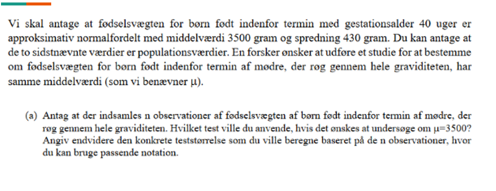

## Eksamens opgave 2

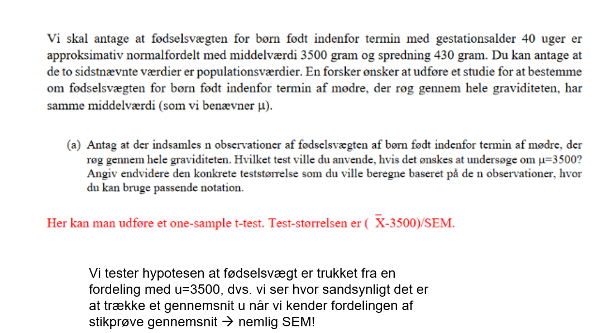

## Nyt Den parrede t-test

Den parrede T-test bruges i situationer, hvor man ønsker at teste om der er signifikant forskel mellem 2 gennemsnit opnået fra samme stikprøvegennemsnit. Scenariet ses ofte ved test af en behandling, hvor man ønsker at vide om en behandling X har givet signifikant forskellige målinger hos en stikprøve af patienter. Eksempelvis: 35 personer får målt blodtryk før og efter behandling med betablokker i 6 måneder. Dvs vi får eks. følgende målinger:

Hvis vi måler gnmsnit for værdier før og efter og lader som det er en two sample t-test bliver dette for upræcist. Dette skyldes at variationen i blodtryk før og efter er mindre end hvis man havde taget fra 2 forskellige grupper og målt  Det er jo den samme person, der har to målinger!

Derfor udregner vi i stedet differensen for hver måling og tilhørende SD. Vi har antallet af personer som indgår i prøven  dermed kan vi udregne en SEM for gnssnitsdifferensen i vores stikprøve.

Så laver vi bare en T-test med 0-hypotesen at stikprøven er trukket fra en baggrundspopulationen med en forskel på 0!  SMART

DVS (mean(diff)-0)/SEM(diff) = T-test

## Eksamensopgave

Patienter med diverticulitis kan have gavn af fiberrig kost. I denne opgave skal vi se på et studie vedrørende transsittiden gennem fordøjelseskanalen under to mulige behandlinger (diæter). En stikprøve af 60 patienter med diverticulitis i alderen 20-44 år blev tilfældig udvalgt og patienterne afprøvede begge behandlinger, A og B, over to perioder med en behandling i en given periode. For hver patient under hver behandling måltes transittiden gennem fordøjelseskanalen. Disse tider er angivet nedenfor for de første 6 patienter for hver af de to behandlinger. Søjlen Diff indeholder differenserne. Endvidere er der angivet nogle summariske regnestørrelser. 

Undersøg om der er signifikant forskel på behandling A og B hvad angår transittiden?

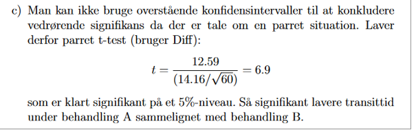](images/paste-6.png)

## Den lineære model

I modul 1 beskrev vi reference-intervaller, konfidensintervaller og T-test. Konfidens-intervaller og T-test kunne give et bud på om eks. yngre og ældre havde signifikant forskellig lungefunktion dvs. vi undersøgte om en kategorisk variabels (eks. Yngre vs. Ældre) association med en kontinuert variabel (eks. lungefunktion).

Sagt på en anden måde var exposure kategorisk og outcome kontinuert.

Hvis man eks. ønsker at undersøge om en kontinuert variabel eks. vægt er associeret med blodtryk undersøger man altså om en kontinuert exposure (vægt) er associeret med et kontinuert outcome (eks. blodtryk).

Hertil bruger man regression  Hvis kun én exposure undersøges bruges lineær regression.\
Hvis flere exposures ønskes undersøgt på én gang bruger man multipel lineær regression (modul 3). OBS man kan også medtage kategoriske variable i lineære modeller.

## Er plasma volumen lineært associeret med kropsvægt?

For at undersøge om en association mellem to variable er lineært associeret kan man plotte data-punkterne på en graf som nedenfor. Dette kaldes et scatter-plot. Fordelingen ser tilnærmelsesvist lineær ud, hvorfor man kan udregne en ligning for den linje, som har den laveste antal ”squares”, dvs. den linje som er tættest associeret til alle datapunkterne.

Ligningen for den rette linje, der beskriver datapunkterne er:

$$y_i = \alpha + \beta x_j + \epsilon_j$$ Y = responsvariabel X = forklarende variabel a= Interceptet (B0) dvs. y´s værdi når x er 0. B = regressionskoefficienten dvs. bedste hældning med lavest antal squares.

E = residual variation som antages at være normalfordelt

## Responsvariabel og forklarende variabel (kontinuert og kategorisk)

Vi ser på et diagram over højde og vægt. Hvad forventer du er responsvariabel?

Hvad forventer du er forklarende variabel?

Er forklarende variabel kontinuert eller kategorisk?

SVAR: Responsvariabel er vægt.

Forklarende variabel er højde.

Højde er en kontinuert forklarende variabel.

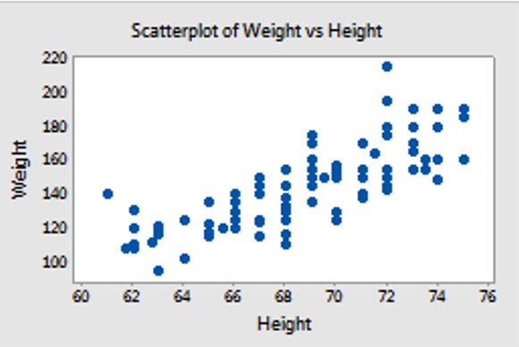

## I R

Forskellige regressionsanalyser i R har forskellige kommandoer. De vigtigste er:

Lineær regression (Modul 2)  lm(y \~ x)

Multipel lineær regression (Modul 3)  lm(y \~ x + z), I multiple lineær regression kan man inkludere mange flere end blot to forklarende variable. Vi vender tilbage til denne!

Logistisk regression (Modul 4)  glm(lbwt \~ factor(smoke) + age, family=binomial) Vi vender tilbage til denne!

## Fortolkning af output fra lm i R

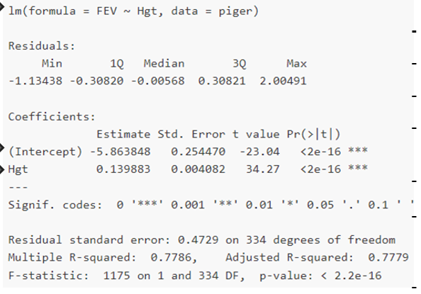 Mange informationer, men vi skal kun bruge nogle få: - Regressionstype: lm med kun 2 variable = simpel lineær - Responsvariabel: FEV Forklarende kontinuert variabel: Hgt Intercept er B0, dvs. når FEV når højde=0 Estimate angiver den estimerede hældning dvs. B1. Så modellen y = 0.139883x-5.86

Std. error angiver SE dvs. den usikkerhed estimaterne er givet ved, kan bruges til konfidensinterval og t-værdi. t value. Angiver Estimate / std. Error, bruges til at slå op i t-fordelingen. Dette opslag giver selve p-værdien, som er sandsynligheden for at få en større t værdi end de observerede t’er. P-værdi er procent over og under t-værdien i en standard-normalfordeling. Dvs. kan fortælle om estimatet er signifikant.

## eksamensopgave

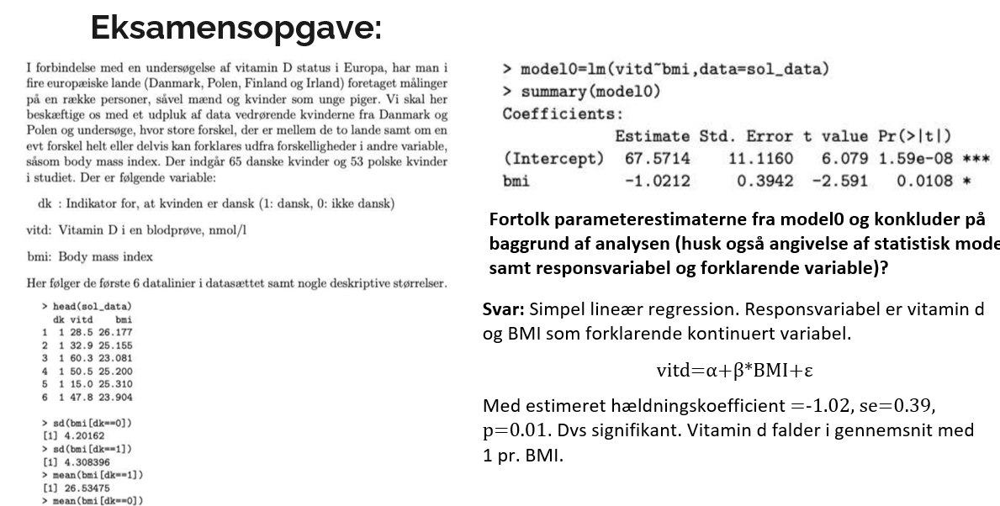

## Std. Error, t- og p-værdi i lineær regression

Estimatet har altså en usikkerhed svarende til Std. Error. Dermed kan man lave en one sample t-test for hvor sandsynligt der er at finde denne stikprøve hvis hældningskoefficienten i baggrundsbefolkningen i virkeligheden er 0 

T-test = (Estimate -0)/Std. Error

Ovenstående giver t-værdien, og p-værdien er regnet ud fra denne! Udregning: (0.139/0.00408) =

Dvs meget usandsynligt!

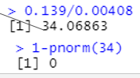

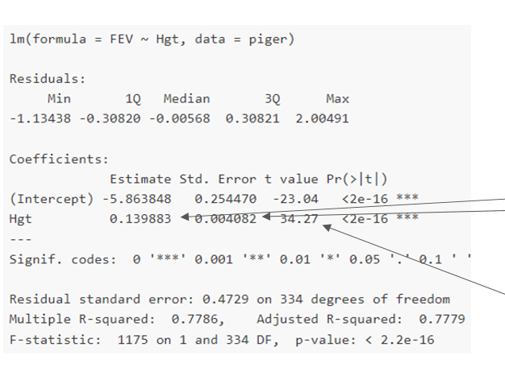

## Eksamensopgave

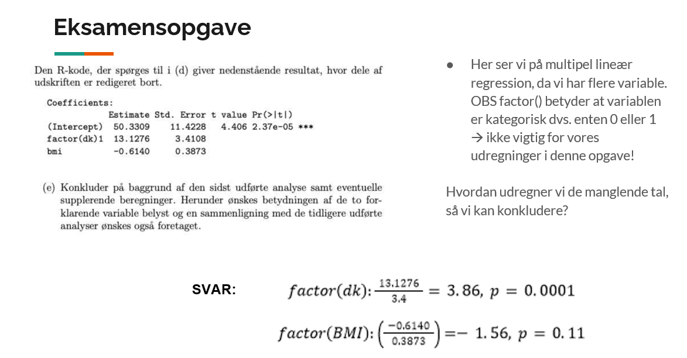

## Prædiktion

Formålet med statistiske modeller er at kunne forudsige (prædiktere, predict). Husk at vi anser vores datasæt som en stikprøve ud af hele populationen. Hvis stikprøven er repræsentativ for populationen (den deskriptive statistik), vil vi kunne forudsige noget om resten af populationen på baggrund af modellen, hvis modellen er god. OBS: y = ax + b + ε, hvor epsilon angiver et fejlled (tænk standardafvigelsen). Så hvis vi skulle simulere, ville vi tage et ekstra normalfordelt led med, men det er lidt mere avanceret  DET GØR VI IKKE! Vi tager vores model igen: Ud fra denne har vi ligningen y=-5.86 + 0.139

Vi kan bruge denne til at prædiktere FEV ved en given højde eksempelvis højde 2 meter dvs 200cm 

-5.86 + 0.139\*200 = 22.1 prædikteret

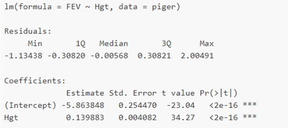

## Eksamensopgave

Du får nedenstående model. Modellen er multipel lineær regression, derfor introduceres 2 nye regler til prædiktion: 1. Hvis variablen er factor() indikerer dette eks. om patienten har fået halothane eller ej, dvs. Den er kategorisk og indgår i prædiktion som enten 1 eller 0 gange estimatet. 2. I multipel lineær regression adderes hvert led og dens værdi på i regnestykket, dvs. intercept + leg*0.79 + factor(drug)* 7.41 = prædikteret værdi

](images/paste-16.png)

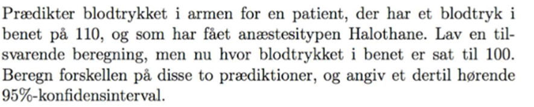